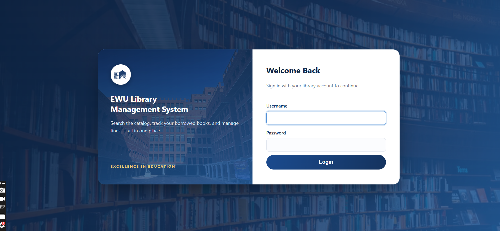
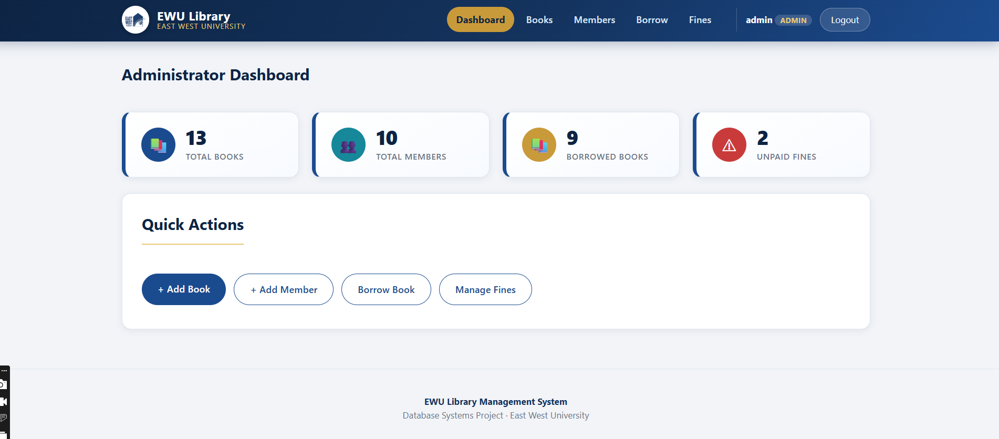
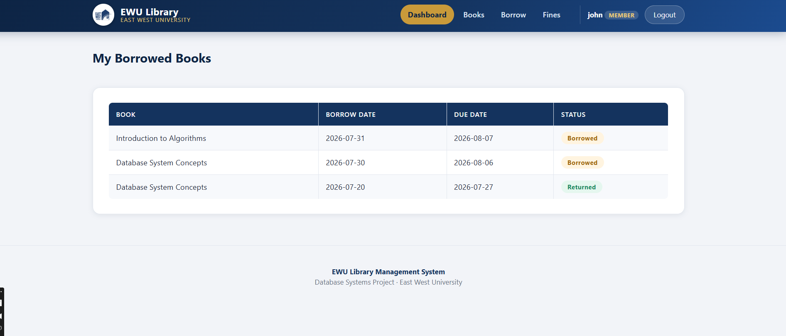

#  EWU Library Management System

A full-stack, database-backed Library Management System built for **CSE302 — Database Systems** at **East West University**. It manages the complete lifecycle of a university library: book catalog, member registration, borrowing/returning, and fine collection — with distinct **Admin** and **Member** roles.


---

## Table of Contents
- [Overview](#overview)
- [Features](#features)
- [Tech Stack](#tech-stack)
- [Database Schema](#database-schema)
- [User Roles](#user-roles)
- [Project Structure](#project-structure)
- [Getting Started](#getting-started)
- [Demo Logins](#demo-logins)
- [Security](#security)
- [Screenshots](#screenshots)
- [Team & Contribution](#team--contribution)

---

## Overview

This project simulates a real-world library system for East West University. It was designed from scratch — starting with an ER model, normalized into a relational schema, and implemented as a working PHP/MySQL application with a styled, functional GUI covering full **CRUD** operations for every core entity.

**Core purpose:** allow the library to track its catalog, its registered members, who has borrowed what and when it's due, and any overdue fines — while giving members self-service visibility into their own borrowing history.

## Features

**Admin**
- Add, edit, and delete books (with author / category / publisher references)
- Add, edit, and delete members (creates the login account *and* library profile together)
- Process book borrowing and returns
- View and settle member fines
- Full visibility into all members, borrow records, and fines

**Member**
- Log in to a personal dashboard
- View their own borrowing history and current status (Borrowed / Returned / Overdue)
- View their own fines

**System-wide**
- Role-based access control (Admin vs Member)
- Secure authentication (bcrypt-hashed passwords, session-based login)
- CSRF-protected forms on every state-changing action
- Referential integrity enforced at the database level (foreign keys, cascading deletes where appropriate)

## Tech Stack

| Layer | Technology |
|---|---|
| Language | PHP 8 (procedural, `mysqli` with prepared statements) |
| Database | MySQL / MariaDB (InnoDB engine, foreign keys enforced) |
| Frontend | Server-rendered HTML + custom CSS (no framework) |
| Local environment | XAMPP / WAMP |

## Database Schema

The schema consists of **8 normalized tables**:

| Table | Purpose |
|---|---|
| `users` | Login credentials and role (`Admin` / `Member`) |
| `members` | Library-specific profile linked 1:1 to a `users` row (student ID, name, phone, department) |
| `books` | Book catalog entries |
| `authors` | Book authors (1:N with `books`) |
| `categories` | Book genres/categories (1:N with `books`) |
| `publishers` | Book publishers (1:N with `books`) |
| `borrows` | Borrow/return records linking a `member` to a `book` (1:N from both sides) |
| `fines` | Fine records tied to a specific `borrow` (1:1, existence-dependent — a weak entity) |

> 📌 The full ER diagram and schema conversion notes are included in the project report (`docs/`).

## User Roles

| Role | Access |
|---|---|
| **Admin** | Full CRUD on books and members, manage borrow/return, manage fines, view all records |
| **Member** | Read-only access to their own borrow history and fine status |

## Project Structure

```
ewu-library-management/
├── assets/
│   ├── css/style.css          # Global stylesheet
│   └── images/                 # Logo & imagery
├── includes/
│   ├── db_connect.php          # DB connection (credentials isolated here)
│   ├── auth.php                # Session handling, role guards, CSRF helpers
│   └── functions.php           # Shared helpers (e.g. safe HTML output)
├── index.php                   # Redirects to login
├── login.php / logout.php
├── admin_dashboard.php / member_dashboard.php
├── view_books.php / add_book.php / edit_book.php / delete_book.php
├── view_members.php / add_member.php / edit_member.php / delete_member.php
├── borrow_book.php / return_book.php / view_borrows.php
├── pay_fine.php / view_fines.php
├── header.php / footer.php
├── ewu_library.sql             # Full schema + seed data
├── fix_member_delete.sql       # Patch: adds ON DELETE CASCADE (see Setup)
└── SECURITY.md                 # Security hardening notes
```

## Getting Started

**Prerequisites:** a local server stack with PHP 8+ and MySQL/MariaDB (e.g. [XAMPP](https://www.apachefriends.org/) or WAMP).

1. **Clone the repository**
   ```bash
   git clone https://github.com/Afri-Tah/ewu-library-management.git
   ```

2. **Import the database**
   In phpMyAdmin (or via CLI), create a database named `ewu_library` and import:
   ```bash
   mysql -u root -p ewu_library < ewu_library.sql
   mysql -u root -p ewu_library < fix_member_delete.sql
   ```
   > `fix_member_delete.sql` adds `ON DELETE CASCADE` to the member→borrows relationship so deleting a member correctly cleans up their borrow/fine history. Run it right after `ewu_library.sql`.

3. **Place the project in your server's document root**
   e.g. `C:\xampp\htdocs\ewu-library-management`

4. **Configure the database connection**
   Edit `includes/db_connect.php` if your MySQL username/password differ from the XAMPP default (`root` / empty password).

5. **Run it**
   Start Apache & MySQL in XAMPP, then visit:
   ```
   http://localhost/ewu-library-management/
   ```

## Demo Logins

| Username | Password | Role |
|---|---|---|
| `admin` | `admin123` | Admin |
| `john` | `john123` | Member |
| `sarah` | `sarah123` | Member |
| `tanvir` | `tanvir123` | Member |

> Passwords are stored as bcrypt hashes in the database — the table above is for testing/demo purposes only.

## Security

This project follows standard secure-coding practices for a database-backed web app:

- Prepared statements everywhere (no raw SQL string interpolation)
- Bcrypt password hashing (`password_hash()` / `password_verify()`)
- Role-based route guards (`require_login()` / `require_admin()`) on every page
- CSRF tokens on all state-changing forms
- Output escaping (`htmlspecialchars`) to prevent XSS
- Transaction-safe borrowing logic (`SELECT ... FOR UPDATE`) to prevent race conditions on book stock

Full details in [`SECURITY.md`](./SECURITY.md).

## Screenshots

**Login**


**Admin Dashboard**


**Member Dashboard**


> A fuller set of screenshots covering every CRUD operation and role is included in the full project report.

## Team & Contribution

| Name | Student ID | Contribution % |
|---|---|---|
| _Afrida Tahsin _ | _2024-3-60-114_ | _40%_ |
| _Nusrat Islam Tasmim_ | _2024-3-60-042_ | _30%_ |
| _Zannatul Hasan Roza_ | _2024-3-60-246_ | _30%_ |


---

Developed for **CSE302 — Database Systems**, East West University.
